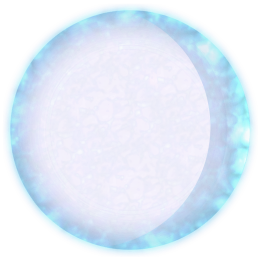
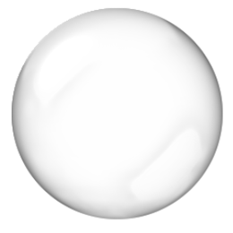

# Tank Settings Object

Settings object is passed to `tank.init(function(settings, info) { ... })` of [AI Scripts](./ai_script.md). You can modify its properties to change initial settings of your tank. For example:

```javascript
  tank.init(function(settings) {
    settings.SKIN = 'lava';
    settings.SHILD_SKIN = 'magic_blue'
  });
```

Here is how the structure of settings object looks like:

```javascript
  {
    SKIN: 'forest',
    SHILD_SKIN: 'magic_blue'
  }
```

Name             | Possible Values   | Description
-----------------|-------------------|----------------------------------------
**SKIN**         | forest, desert, ocean, lava, black, zebra, tiger  | Changes painting of the tank


## Tank Skins
Preview                                  | Configuration
-----------------------------------------|--------------------------
    | `settings.SKIN = 'forest'`
    | `settings.SKIN = 'desert'`
     | `settings.SKIN = 'ocean'`
      | `settings.SKIN = 'lava'`
     | `settings.SKIN = 'black'`
     | `settings.SKIN = 'zebra'`
     | `settings.SKIN = 'tiger'`


## Tank Shild Skins
Preview                                  | Configuration
-----------------------------------------|--------------------------
    | `settings.SHILD_SKIN = 'magic_orange'`
    | `settings.SHILD_SKIN = 'electric'`
     | `settings.SHILD_SKIN = 'bubble'`
      | `settings.SHILD_SKIN = 'magic_blue'`
     | `settings.SHILD_SKIN = 'light'`
